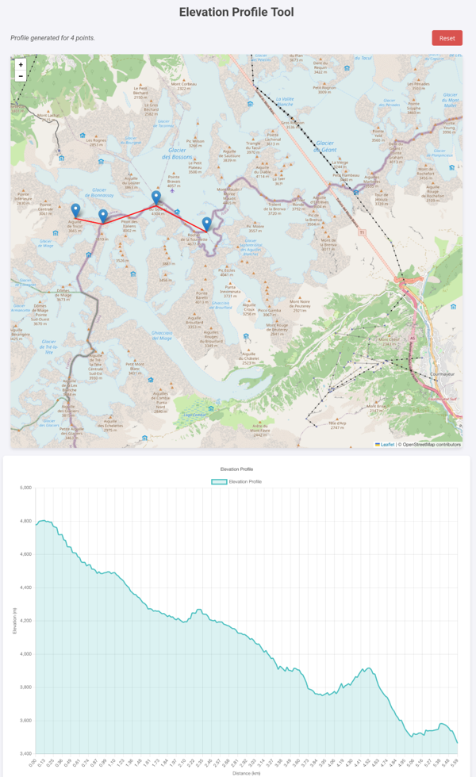

# GEDTM30API

This project provides a high-performance elevation service from Cloud-Optimized GeoTIFF (COG) or GDAL VRT files.
It exposes the service via both a traditional HTTP REST API and a modern, high-performance gRPC API.
The service is optimized for low-latency queries by using on-demand tile fetching, in-memory caching, and concurrent request handling.

The primary data source is [Global Ensemble Digital Terrain Model 30m (GEDTM30)](https://zenodo.org/records/15689805).
It also supports [USGS 3DEP 1/3 arc-second (~10m)](https://prd-tnm.s3.amazonaws.com/index.html?prefix=StagedProducts/Elevation/) data via remote VRT files.

## Features

-   **Dual API Support**: Access elevation data through both a simple HTTP REST API and a typed, high-performance gRPC API.
-   **Cloud-Optimized GeoTIFF (COG) Support**: Efficiently reads data from large GeoTIFF files without needing to download the entire file. It fetches only the required header information and raster tiles on-demand.
-   **Flexible Data Sources**: Works seamlessly with GCS, S3, Azure Blob Storage, HTTP remote COGs (via HTTP range requests) or local `.tiff` files.
-   **VRT (Virtual Raster) Support**: Supports GDAL `.vrt` files for mosaicking multiple GeoTIFFs into a single virtual dataset. The VRT file is fetched from cloud/local just like a COG, and source tiles are lazily opened and cached on-demand. Remote VRT files referencing `/vsicurl/` paths are resolved transparently.
-   **LZW Compression Support**: Handles LZW-compressed TIFF tiles (common in USGS 3DEP data) via CGo/libgeotiff integration. Both local and remote LZW tiles are decoded using libtiff's proven decoder with predictor support.
-   **High-Performance Caching**: Utilizes an in-memory LRU cache (`ccache`) to store *processed* tile data. This dramatically reduces I/O and CPU load for subsequent requests to nearby geographic areas.
-   **Concurrent Request Handling**: Implements a `singleflight` mechanism to prevent the "thundering herd" problem, ensuring that concurrent requests for the same uncached tile result in only one fetch operation.
-   **Intelligent Prefetching**: When a tile is requested, its neighbors are preemptively and concurrently fetched in the background to improve latency for spatially coherent queries (like generating a profile).
-   **Production-Ready Structure**: Includes separate servers for the API, health checks (`gRPC`), and metrics (`Prometheus`), all managed with graceful shutdown.

## Getting Started

### Data
The server is defaulting to the most recent url for GEDTM30, but you probably want to download the file and host it yourself (310GB for the whole world), since no guarantee this url will always be available.

You can also extract some extend, note that you will need to rebuild the file as follow:
```sh
gdal_translate -of COG \
  -co COMPRESS=DEFLATE \
  -co ZLEVEL=6 \
  -co TILED=YES \
  extend.tiff extend-cog.tiff
```

#### VRT Files (Virtual Raster)

VRT files allow you to combine multiple GeoTIFF files into a single virtual mosaic without duplicating data. To create a VRT from one or more GeoTIFF files:

```sh
gdalbuildvrt mosaic.vrt tile1.tiff tile2.tiff tile3.tiff
```

When the server detects a `.vrt` extension, it parses the VRT XML to understand the overall raster layout and lazily opens the referenced source TIFFs as queries come in. Source TIFF readers are cached after first use and their tile caches operate independently for maximum efficiency.

The VRT file itself can be stored in cloud storage alongside its source TIFFs — `relativeToVRT` paths in the VRT are resolved automatically against the VRT's directory. Remote VRT files referencing `/vsicurl/` paths (GDAL virtual filesystem) are handled transparently.

#### USGS 3DEP 1/3 arc-second (~10m) via Remote VRT

The USGS publishes elevation data as Cloud-Optimized GeoTIFFs on S3. You can serve the entire continental US at ~10m resolution by pointing at a remote VRT file — no data download required:

```sh
# Serve USGS 3DEP 1/3 arc-second (~10m) for tile 13 (California/Nevada area)
CGO_ENABLED=1 go build .
LOG_LEVEL=INFO COG_SOURCE="https://prd-tnm.s3.amazonaws.com/StagedProducts/Elevation/13/TIFF/USGS_Seamless_DEM_13.vrt" ./gedtm30api
```

Find other VRT tiles at: https://prd-tnm.s3.amazonaws.com/index.html?prefix=StagedProducts/Elevation/

**Note**: USGS tiles use LZW compression, which requires building with CGo enabled (`CGO_ENABLED=1`) and libtiff installed (`libtiff-devel` or `libtiff-dev`). The service falls back to Go's LZW decoder for non-CGo builds, but libtiff is recommended for correctness.

Example VRT structure:
```xml
<VRTDataset rasterXSize="739" rasterYSize="795">
    <GeoTransform>6.779250, 0.000250, 0.0, 45.926250, 0.0, -0.000250</GeoTransform>
    <VRTRasterBand dataType="Float32" band="1">
        <SimpleSource>
            <SourceFilename relativeToVRT="1">tile.tiff</SourceFilename>
            <SourceBand>1</SourceBand>
            <SrcRect xOff="0" yOff="0" xSize="739" ySize="795"/>
            <DstRect xOff="0" yOff="0" xSize="739" ySize="795"/>
        </SimpleSource>
    </VRTRasterBand>
</VRTDataset>
```

### Running the Server

```sh
go install github.com/akhenakh/gedtm30api@latest
gedtm30api
```

### Environment Variables
- LOG_LEVEL envDefault:"INFO"
- HTTP_PORT envDefault:"8080"
- API_PORT envDefault:"9200"
- HEALTH_PORT envDefault:"6666"
- METRICS_PORT envDefault:"8888"
- BUCKET_URI
  Example S3: BUCKET_URI="s3://my-bucket?region=us-east-1", OBJECT_KEY="path/to/image.tif"
  Example GCS: BUCKET_URI="gs://my-bucket", OBJECT_KEY="image.tif"
  Example Azure: BUCKET_URI="azblob://bucket" OBJECT_KEY="image.tif"
  Example File: BUCKET_URI="file:///path/to/dir", OBJECT_KEY="image.tif"
- COG_SOURCE envDefault:"https://s3.opengeohub.org/global/edtm/gedtm_rf_m_30m_s_20060101_20151231_go_epsg.4326.3855_v20250611.tif"`
  Use it for HTTP access. Can point to a `.tiff` or `.vrt` file.
- CACHE_MAX_SIZE envDefault:"1024" number of tiles to keep in the cache
- CACHE_ITEMS_TO_PRUNE envDefault:"100" number of tiles to prune from the cache
The server will start multiple services on different ports:
-   **HTTP REST & Web UI**: `http://localhost:8080`
-   **Prometheus Metrics**: `http://localhost:8888/metrics`
-   **gRPC API**: `localhost:9200`
-   **gRPC Health Checks**: `localhost:6666`

### Use a Local File

To use a local GeoTIFF or VRT file, set the `COG_SOURCE` environment variable to the file path:

```sh
COG_SOURCE="/path/to/your/data.tiff" gedtm30api

# Or for VRT files:
COG_SOURCE="/path/to/your/mosaic.vrt" gedtm30api
```

## API Reference

### HTTP REST API

The REST API is available on port `8080` by default.

#### Get Elevation for a Single Point

Returns the elevation in meters for a single latitude/longitude coordinate.

-   **Endpoint**: `/getElevation/{lat}/{lng}`
-   **Method**: `GET`
-   **URL Parameters**:
    -   `lat`: Latitude (float)
    -   `lng`: Longitude (float)

-   **Example Request**:
    ```sh
    curl http://localhost:8080/getElevation/45.8329/6.8648
    ```

-   **Example Success Response** (`200 OK`):
    ```json
    {
      "elevation": 4805.3,
      "latitude": 45.8329,
      "longitude": 6.8648
    }
    ```

#### Get Elevation Profile for a Path

Returns a list of elevation points along a path defined by two or more coordinates.

-   **Endpoint**: `/getProfile/`
-   **Method**: `POST`
-   **Request Body**: A JSON object containing a list of `[latitude, longitude]` pairs.

-   **Example Request**:
    ```sh
    curl -X POST -H "Content-Type: application/json" \
      -d '{"coordinates":[[46.5, 6.5], [46.6, 6.6]]}' \
      http://localhost:8080/getProfile/
    ```

-   **Example Success Response** (`200 OK`):
    A JSON array where each element is `[latitude, longitude, elevation]`.
    ```json
    [
      [46.5, 6.5, 435.6],
      [46.500135, 6.500150, 436.1],
      [46.500270, 6.500300, 436.8],
      ...
      [46.6, 6.6, 612.9]
    ]
    ```

### gRPC API

The service definition can be found in `proto/elevation.proto`.

#### Service: `ElevationService`

##### `GetElevation` RPC

Retrieves the elevation for a single coordinate.

-   **Request**: `ElevationRequest`
    ```protobuf
    message ElevationRequest {
      double latitude = 1;
      double longitude = 2;
    }
    ```
-   **Response**: `ElevationResponse`
    ```protobuf
    message ElevationResponse {
      float elevation = 1;
    }
    ```

-   **Example with `grpcurl`**:
    ```sh
    grpcurl -plaintext -d '{"latitude": 45.8329, "longitude": 6.8648}' \
      localhost:9200 elevationapi.ElevationService.GetElevation
    ```

##### `GetProfile` RPC

Retrieves an elevation profile along a path.

-   **Request**: `ProfileRequest`
    ```protobuf
    message ProfileRequest {
      repeated Point points = 1;
    }
    message Point {
      double latitude = 1;
      double longitude = 2;
    }
    ```
-   **Response**: `ProfileResponse`
    ```protobuf
    message ProfileResponse {
      repeated ElevationPoint points = 1;
    }
    message ElevationPoint {
      double latitude = 1;
      double longitude = 2;
      float elevation = 3;
    }
    ```

-   **Example with `grpcurl`**:
    ```sh
    grpcurl -plaintext -d '{"points": [{"latitude": 46.5, "longitude": 6.5}, {"latitude": 46.6, "longitude": 6.6}]}' \
      localhost:9200 elevationapi.ElevationService.GetProfile
    ```

## Web Interface

A simple web UI is available at `http://localhost:8080`. It allows you to interactively click on a map to get single-point elevations or generate and visualize elevation profiles.



## Cache Management

The server uses a cache to store recently accessed tiles. The cache size can be configured using the `CACHE_MAX_SIZE` environment variable. When the cache reaches its maximum size, the least recently used tiles are pruned to make room for new ones. The number of tiles to prune can be configured using the `CACHE_ITEMS_TO_PRUNE` environment variable.

With 512 × 512 tiles, since a pixel is using 4 bytes (for a float32 or int32), 262,144 pixels × 4 bytes/pixel = 1,048,576 bytes.

So 128 tiles would account for 128 MiB in memory.

## GeoTIFF library

The geoTIFF library supports DEFLATE-compressed and LZW-compressed COGs with horizontal and floating-point predictors.
It is reusing some code from [geotiff](https://github.com/gden173/geotiff).

LZW decompression is handled via CGo/libgeotiff (`libtiff-devel` required) for both local files and remote HTTP sources.
The library provides a `GeoRaster` interface that unifies direct GeoTIFF access and VRT-based virtual mosaics, allowing both to be used interchangeably throughout the codebase.

For builds without CGo (`CGO_ENABLED=0`), LZW support falls back to a pure Go decoder which may not handle all LZW variants correctly.
It was reported to work with USGS 10m data.
